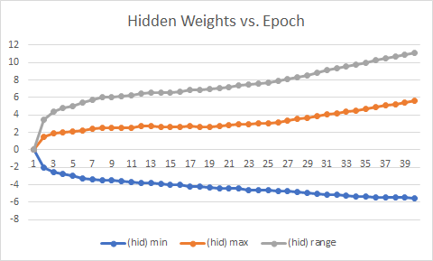
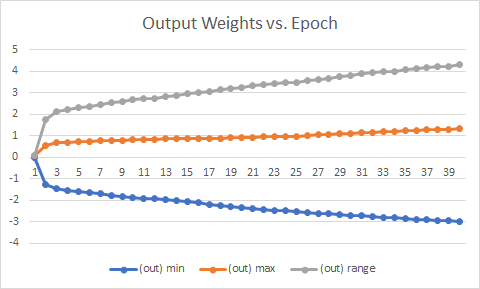

# Fixed Point Neural Networks
# Part of the WINLAB Summer 2021 Research Internship -Binary Neural Networks Group

It is vital to understand the dynamic range of the weights within our network to reasonably estimate the size that our fixed-point implementation should be. By observing the graphs below, we determined that a 8-bit integer and 56-bit fraction should suffice for our implementation.

Figure 1

Figure 2

According to the Figure 1 and Figure 2 above, the 8-bit integer (1 sign bit) is more than enough to represent the small whole number parts of the highest and lowest weights in the network, even though the dynamic range does not appear to stablize with training iterations.
